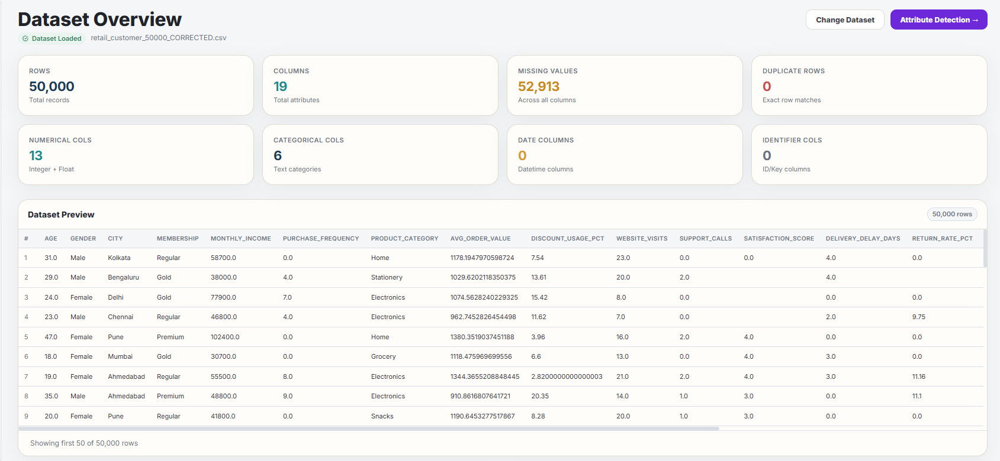
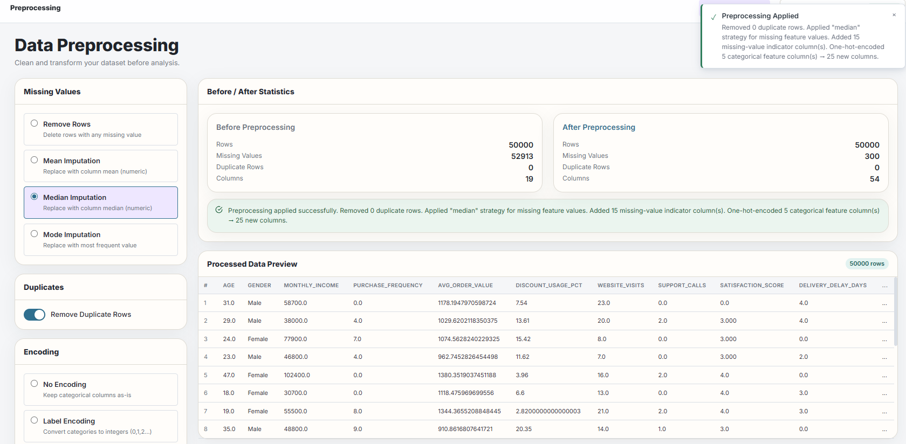
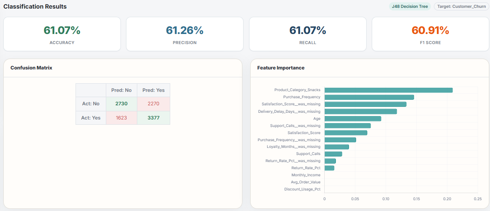
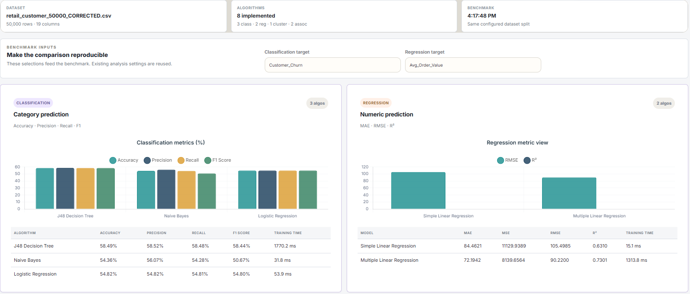

# MineLab

MineLab is a browser-based data mining workbench for exploring datasets, applying common preprocessing steps, and running classification, regression, clustering, and association-rule algorithms.

## Run MineLab

1. Download or clone this repository.
2. Open `index.html` in a current desktop browser (Chrome or Edge recommended).
3. Import a CSV or Excel dataset, or choose a built-in sample dataset.
4. Explore the dataset, configure preprocessing, and run an analysis from the sidebar.

The app is a static client-side project; no server or package installation is needed. It loads Papa Parse, SheetJS, Chart.js, and html2pdf.js from public CDNs, so an internet connection is needed for those libraries. Browser support for opening local files may vary; if the page does not load scripts correctly, serve the project directory with a local static web server.

## What it includes

- CSV and Excel dataset import, validation, attribute detection, summary statistics, and visualizations.
- Missing-value handling, duplicate removal, categorical encoding, scaling, outlier handling, and feature selection.
- Classification: J48-style decision tree, Naive Bayes, and logistic regression.
- Regression: simple linear and multiple linear regression.
- Clustering: K-means.
- Association rules: Apriori and FP-Growth.
- Result comparison, charts, and downloadable reports/exports.

## Live demo

Open the deployed app: [minelab-dwm.netlify.app](https://minelab-dwm.netlify.app/).

## Screenshots

These screenshots show MineLab using the included retail benchmark dataset.

### Dataset overview

<a href="docs/screenshots/dataset-overview.png"></a>

### Preprocessing

<a href="docs/screenshots/preprocessing.png"></a>

### Classification results

<a href="docs/screenshots/classification-results.png"></a>

### Benchmark comparison

<a href="docs/screenshots/benchmark-comparison.png"></a>

## Included datasets

Both CSV files are included in the repository:

- [`retail_customer_50000_CORRECTED.csv`](retail_customer_50000_CORRECTED.csv) — 50,000 rows and 19 columns. This is a **synthetic benchmark**, not observed customer data. It has balanced `Customer_Churn` labels and constructed missingness patterns for demonstrating preprocessing and model comparison.
- [`preprocessing_impact_demo.csv`](preprocessing_impact_demo.csv) — 824 rows and 5 columns. This is **deterministic synthetic teaching data** (800 generated records plus 24 exact duplicates), with missing values and extreme values to demonstrate preprocessing effects.

The built-in sample datasets in [`data/sample-datasets.js`](data/sample-datasets.js) are also generated for demonstration. Do not interpret benchmark scores or these datasets as evidence of real customer behavior or real-world model performance. See [`README-MineLab.txt`](README-MineLab.txt) for the documented benchmark setup and example results.

## Repository layout

```text
MineLab/
├── algorithms/       # Classification, regression, clustering, association rules
├── core/             # Loading, validation, detection, statistics, preprocessing, metrics
├── data/             # Built-in sample datasets
├── docs/             # Project diagrams
├── reports/          # Report generation
├── utils/            # Storage, helpers, exports
├── visualization/   # Charts
├── index.html        # App shell and browser script load order
├── app.js            # UI, routing, and application workflows
├── styles.css        # Interface styles
└── *.csv             # Included demo and benchmark datasets
```

## Technology

Vanilla JavaScript, HTML, and CSS. CSV/XLSX parsing and chart/report features use Papa Parse, SheetJS, Chart.js, and html2pdf.js via CDN.

## License

No license has been specified. All rights remain with the respective authors unless a license is added.
